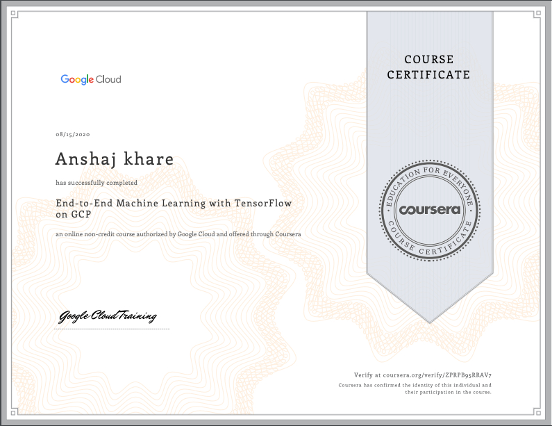

# Advanced Machine Learning with TensorFlow on Google Cloud Platform Specialization

## Courses 
- End-to-End Machine Learning with TensorFlow on GCP
- Production Machine Learning Systems
- Image Understanding with TensorFlow on GCP
- Sequence Models for Time Series and Natural Language Processing
- Recommendation Systems with TensorFlow on GCP

### End-to-End Machine Learning with TensorFlow on GCP
Topics covered
- Scaling machine learning projects 
- Building models with AI platform notebooks
- Creating wide and deep netural nets for structured data
- Writing tensorflow code for distribured learning
- Cloud dataflow for building data processing pipelines that scale
- Deploying the models on google AI platform

Project - An app deployed on google App Engine to **predict the weight of a new born baby**.

